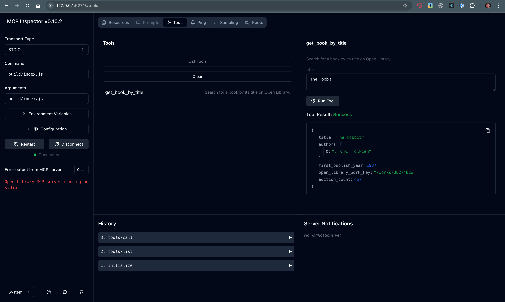

# MCP Open Library

A Model Context Protocol (MCP) server for the Open Library API that enables AI assistants to search for book information.

## Overview

This project implements an MCP server that provides a tool for AI assistants to search the [Open Library](https://openlibrary.org/) for book information by title. The server returns structured data about the most relevant book match, including title, authors, publication year, and other metadata.

## Features

- **Book Search by Title**: Search for books using their title and get detailed information
- **Structured Response Format**: Returns book information in a consistent JSON structure
- **Error Handling**: Proper validation and error reporting
- **Testing**: Comprehensive test coverage with Vitest

## Installation

```bash
# Clone the repository
git clone https://github.com/your-username/mcp-open-library.git
cd mcp-open-library

# Install dependencies
npm install

# Build the project
npm run build
```

## Usage

### Running the Server

You can use the MCP Inspector to test the server:

```bash
npm run inspector
```

Access the MCP Inspector and then test the tool e.g.



### Using with an MCP Client

This server implements the Model Context Protocol, which means it can be used by any MCP-compatible AI assistant or client e.g. [Claude Desktop](https://modelcontextprotocol.io/quickstart/user). The server exposes the following tool:

- `get_book_by_title`: Search for book information by title

Example input:
```json
{
  "title": "The Hobbit"
}
```

Example output:
```json
{
  "title": "The Hobbit",
  "authors": ["J.R.R. Tolkien"],
  "first_publish_year": 1937,
  "open_library_work_key": "/works/OL45883W",
  "edition_count": 120
}
```

## Development

### Project Structure

- `src/index.ts` - Main server implementation
- `src/types.ts` - TypeScript type definitions
- `src/index.test.ts` - Test suite

### Available Scripts

- `npm run build` - Build the TypeScript code
- `npm run watch` - Watch for changes and rebuild
- `npm test` - Run the test suite
- `npm run format` - Format code with Prettier
- `npm run inspector` - Run the MCP Inspector against the server

### Running Tests

```bash
npm test
```

## License

[Add your license here]

## Contributing

Contributions are welcome! Please feel free to submit a Pull Request.

## Acknowledgments

- [Open Library API](https://openlibrary.org/developers/api)
- [Model Context Protocol](https://github.com/modelcontextprotocol/mcp)